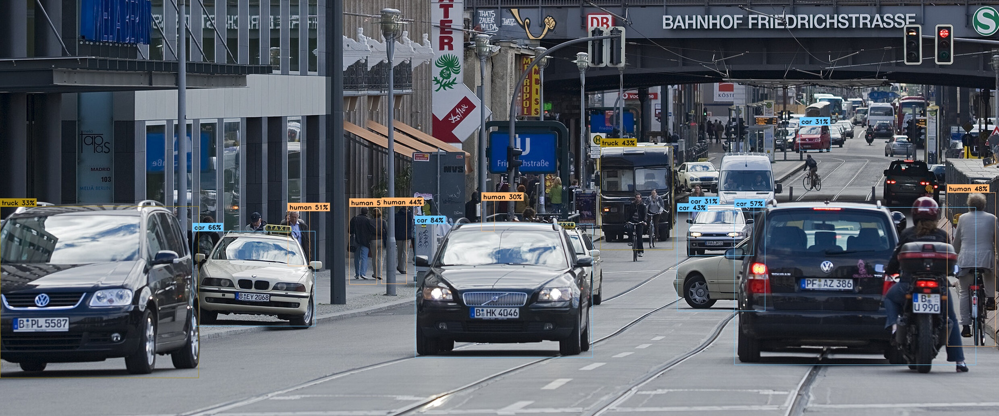

# Car detection project

<p align="center">
  
</p>

## Abstract
In this project I’ll be building an object detector able to detect 12 objects: Animal, human, movable_object, static_object, bicycle, bus, car, construction, emergency, motorcycle, trailer, and truck.

The model is a centerNet with ResNet V2 50 as a feature extractor.

## Resources
* [CenterNet Paper](https://arxiv.org/abs/1904.07850)
* [Nuscenes dataset](https://www.nuscenes.org/nuimages)
* [Tensorflow object detection api](https://github.com/tensorflow/models/tree/master/research/object_detection)

## Before you start
1. Install Python3.
2. Install Tensorflow 2.
3. Install [Tensorflow object detection api](https://github.com/tensorflow/models/blob/master/research/object_detection/g3doc/tf2.md).
4. Download the [nuImages](https://www.nuscenes.org/download) dataset from nuscenes.

## How to use it
1. Change configurations at **configuration.py**
2. Generate json annotations.
3. Generate tfrecord annotations.
4. Train the model.
5. Export the model (not implemented yet but you can use command line).
6. Run detection on images.

## To run
* To create json file annotations
```bash
 python main.py --mode=json
```
* To create tfrecords
```bash
 python main.py --mode=tfrecord
```
* To train the model
```bash
 python main.py --mode=train
```
* To train the model without exporting it
```bash
 python main.py --mode=train --export=False
```
* To export the model
```bash
 python main.py --mode=export
```
* To run detection on an image
```bash
 python main.py --mode=detect --path={path to your image}
```

## Todos
* Running detection on video.
* Parser for configuration file.
* Handle exceptions in tfrecord generation.

## Margin
* [Download weights I've already trained](https://drive.google.com/drive/folders/1srMUxkCxiJHRAMOVxEOQg4atKkNFpx0Y?usp=sharing)
